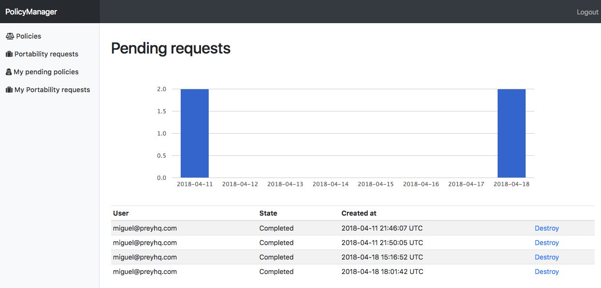

# GDPR RAILS

### Rails Engine for the GDPR compliance

> The world needs some privacy, please


[](https://travis-ci.org/prey/gdpr_rails)

[](https://codeclimate.com/github/prey/gdpr_rails/maintainability)

## About this project

PolicyManager (Aka GDPR RAILS) was created with flexibility in mind to comply with the requirements of the GDPR ([General Data Protection Regulation](https://www.eugdpr.org/)). It's currently being developed at preyproject and will be battle-tested on [preyproject.com](https://preyproject.com) from May 25th.

### Main Features:

#### Policy Rules
+ Configurable policy rules, supports activerecord validations for new or existing users
+ Supports session-less consent policies which will become persistent once the user signs in or signs up
+ Versioning system for new policies
+ JSON endpoints to handle pending policies and portability logic in order to be implemented in *client only* interfaces, ie: frontend apps like React, Vue, Backbone, you name it.

#### Portability
Portability module lets you define export options, that will generate a navigable static site with all the data you've defined in the **portability rules**
+ Seamless data export with configurable templates
+ Configurable Mailer templates for progress & download completion
+ Downloads images to the local filesystem in order to comply with GDPR requirements on data accessibility.
+ Zips all the information and delivers it with a expirable download link
+ ActiveJob to handle the process
+ Behind the scenes uses the paperclip gem in which you can set up storages, like S3, Google

#### Scripts & Cookies
Configurable *scripts* which will bind cookie names in order to handle the script rendering and the cookie clean up. 

#### Forgotability
+ TBD, for now we simply delete all the data when a user closes the account.  This could be handled in the future with encryption like in emails or other kind of sensible fields on a database.

### Admin Panel


## Installation
Add this line to your application's Gemfile: 

as `gem 'gdpr_rails'`

Then in your application.rb require the policy_manager lib with 

`require "policy_manager"`

Install & run the migrations

`rake policy_manager:install:migrations`

## Usage examples

### Basic config
```ruby
config = PolicyManager::Config.setup do |c|  
  c.logout_url = "logout"
  c.from_email = "admin@acme.com"
  # is_admin method in order for engine to know  
  # how to authorize admin only areas  
  c.is_admin_method = ->(o){ 
    o.is_god? || o.is_admin? || o.is_me? || o.watheva
  }
```

In order for this engine to work you must supply some rules according to your needs, in order to be in comply with the GDPR you will need 3 rules at least. A cookie consent, a Privacy& TOS and an Age  confirmation (+16). 
So, let's start by doing that: 

## Term rules

In your app router add the following:

```ruby
  mount PolicyManager::Engine => "/policies"
```

Then add an initializer, `config/initializers/gdpr.rb` and inside it set your policy rules.

```ruby
PolicyManager::Config.setup do |c|
  c.add_rule({name: "cookie", sessionless: true }  )
  c.add_rule({name: "age", validates_on: [:create, :update], blocking: true })
  c.add_rule({name: "privacy_terms", validates_on: [:create, :update], blocking: true })
end

# If you are using devise, you must extend engines's controller with devise helpers in order to get current_user
PolicyManager::UserTermsController.send(:include, Devise::Controllers::Helpers)
```

> Note that you will need to go to the policy panel and add the policy
> content for each term at `http://localhost:3000/policies/categories` otherwise you will see errors like `no term for #{rule} policy`

### ActiveRecord Methods

When the policies are configured will generate some helper methods on User model. For example, with the example above you will get the following methods for free:

+ `@user.has_consented_cookie?`
+ `@user.has_consented_age?`
+ `@user.has_consented_privacy_terms?`
#### also you get:
+ `@user.pending_policies`
+ `@user.pending_blocking_policies`
+ `@user.confirm_all_policies!`
+ `@user.reject_all_policies!`
+ `@user.needs_policy_confirmation_for?(rule)`
+ `@user.policy_term_on(rule)`
+ `@user.policy_user_term_on(term)`
+ `@user.handle_policy_for(term)`
+ `@user.can_request_portability?`

## Policy rules:

+ **sessionless:** will allow rules to be available for non logged users, if accepted a cookie `cookies["policy_rule_cookie"]` will be generated. If then the user sign in or signs up you could get this cookie it will persist in database.

**Use this in your controller:**
```ruby
@user.store_policy_cookie if cookies["policy_rule_cookie"] == "accepted"
```
+ **validates_on:** will require users validation, will automagically create virtual attributes for the policy you set, so, if you set `age` in your config you must supply in your forms a `policy_rule_age` checkbox in your form, if you don't supply those then the user validation will return errors on `policy_rule_age` . Don't forget to add the fields in your strong params in the controller which handles the request.
+ **if:** you can add conditions as a Proc in order skip validations:
```ruby
  c.add_rule({name: "age", validates_on: [:create, :update], 
              if: ->(o){ o.enabled_for_validation } })
```
+ **on_reject**: Proc which will be triggered when user rejects a policy (has an argument that contains the controller context)
+ **on_accept**: Proc which will be triggered when user accepts a policy (has an argument that contains the controller context)

#### Example
> This is an example for a `cookie` rule. The expected behavior would be when the user rejects cookies iterate over our scripts and delete cookies:

```ruby
  c.add_rule({name: "cookie", sessionless: true, on_reject: ->(context){
      PolicyManager::Script.cookies
      .select{|o| !o.permanent }
      .each{|o| 
        o.cookies.each{|c| 
          context.send(:cookies).delete(c, domain: o.domain)  
        } 
      }
    }
  })
```

#### Policy handling:

There are some endpoints that will handle json in order to interact with client applications, like react interfaces, $.ajax etc. 
you can also use the html web panel directly from the engine.
So, if the Engine was mounted on `/policies` then your routes will be:

    pending_user_terms          GET    /user_terms/pending(.:format)                     policy_manager/user_terms#pending
    accept_multiples_user_terms PUT    /user_terms/accept_multiples(.:format)            policy_manager/user_terms#accept_multiples
    blocking_terms_user_terms   GET    /user_terms/blocking_terms(.:format)              policy_manager/user_terms#blocking_terms
    accept_user_term            PUT    /user_terms/:id/accept(.:format)                  policy_manager/user_terms#accept
    reject_user_term            PUT    /user_terms/:id/reject(.:format)                  policy_manager/user_terms#reject
    user_terms                  GET    /user_terms(.:format)                             policy_manager/user_terms#index
    user_term                   GET    /user_terms/:id(.:format)                         policy_manager/user_terms#show

## Scripts & Cookies

This is supposed to in mix with your declared cookie term. So, this configuration let's you declare your external scripts that are related with tracking, ie: Google Analytics, Kissmetrics, Google Tag manager, etc... This configuration expects that you declare scripts that will be rendered over certain contexts (environments) and have the names (and domains) of the cookies that those scripts generates.  

#### example: 
```ruby
  c.add_script(
    name: "google analytics",
    script: 'shared/analytics/universal',
    environments: [:production],
    description: ->{I18n.t("cookies.list.google_analytics")},
    cookies: ["_ga", "_gid", "_gat_XXX-XXX"],
    domain: ".panel.preyproject.com"
  )
```

> **Importance of declaring the cookie domain**: When you clean up the cookies (like in the example above for `on_reject`) is important to set the domain that this cookies belongs. In some cases this external scripts could add the cookie on your subdomain or your base domain. In out case we found that some cookies are generated on panel.preyproject.com or .panel.preyproject or just preyproject.com. Try to get that information on chrome console -> application -> cookies.

### Example in your layout:
This is an example on how you would render your scripts only if the user has accepted the cookie
```ruby
    <% if current_user.has_consented_cookie? %>
     <!--  # this cames from portability/helpers/scripts_helpers -->
      <%= render_scripts %>
    <% end %>
```
`render_scripts` will iterate over your configured scripts and render the templates defined on `PolicyManager::Script`

## Portability Rules

Export option & Portability rules will allow you to set up how and which data you will give to a requester user.

#### Exporter:
+ **path**: where the folder will be generated, usually can be set on /tmp, this will need a pathname, like `Rails.root.join("tmp/export")`
+ **resource**: which model , ie: `User`
+ **index_template**: The first page. defaults to a simple ul li list of links tied to your rules, this expects a Pathname or a String with yout template
+ **layout**: A layout template to wrap the static site,  this expects a Pathname or a String with your template
+ **after_zip**: a callback to handle the zip file on the resource, something like: 
```ruby
after_zip: ->(zip_path, resource){ 
  puts "THIS IS GREAT #{zip_path} was zipped, now what ??" 
}   
```

+ **mail_helpers**:  If you have some helpers you want to add to the mailers, then you can pass an Array of helpers, `[MailHelper, OtherMailHelper]`,
+ **attachment_path**: Paperclip upload path , defaults to "portability/:id/build.zip",
+ **attachment_storage**: Paperclip storage, defaults to filesystem , you can set `s3` or `google` or whatever paperclip supports
+ **expiration_link**: integer, defaults to 60 (1 minute),

#### Portability Rules:

Portability rules collection render. This will call a @user.articles
and will auto paginate records

```ruby
PolicyManager::Config.setup do |c|

  # minimal exporter setup
  c.exporter = { 
    path: Rails.root + "tmp/export", 
    resource: User 
  }

  # portability rules, collection render. This will call a @user.articles
  # and will auto paginate records
  # template expects a string or path
  c.add_portability_rule({
    name: "exportable_data", 
    collection: :articles, 
    template: "hello, a collection will be rendered here use @collection.to_json",
    per: 10
  })

  # portability rules, member render. This will call a @user.account_data
  # template expects a string or path
  c.add_portability_rule({
    name: "my_account", 
    member: :account_data,
    template: "hellow , here a resource will be rendered <%= @member.to_json %> "          
  })

end
```
**Important:**
> If the content that will be delivered has images use the `image_tag`
> in your template.  This helper was reimplemented in order for the remote image to be downloaded automatically.
> And will be served locally in order to comply with the
> Portability data requirements.

### Web Endpoints and methods for user:

```
user_portability_requests   GET    /user_portability_requests(.:format)              policy_manager/user_portability_requests#index
                            POST   /user_portability_requests(.:format)              policy_manager/user_portability_requests#create
user_portability_request    DELETE /user_portability_requests/:id(.:format)          policy_manager/user_portability_requests#destroy

```
### Web Endpoints and methods for admin :
this routes are accessible from engine's admin panel
```

confirm_portability_request GET    /portability_requests/:id/confirm(.:format)       policy_manager/portability_requests#confirm
portability_requests        GET    /portability_requests(.:format)                   policy_manager/portability_requests#index
portability_request         DELETE /portability_requests/:id(.:format)               policy_manager/portability_requests#destroy
```


# TO DO
+   anonimyzer 

#### Acknowledgments
+ [Prey Team](https://github.com/orgs/prey/people)
+ Special thanks to our legal GDPR advisor: Paul Lagniel <paul@preyhq.com>

#### Main maintainers
+ Miguel Michelson - miguel@preyhq.com
+ Patricio Jofré - pato@preyhq.com

## Contributing
just fork the repo and send us a Pull Request, with some tests please :)

## License
The gem is available as open source under the terms of the [MIT License](http://opensource.org/licenses/MIT).
